# Estudio de TDD aplicado en el desarrollo al Mastermind
 
## Índice
-   [1. Resumen](#1-resumen)
-   [2. Objetivos](#2-objetivos)
-   [3. TDD](#3-tdd)
    -   [3.1 Introducción](#31-introducción)
    -   [3.2 Las distintas corrientes del TDD](#32-las-distintas-corrientes-del-tdd)
        -   [3.2.1 Inside-out](#321-inside-out)
        -   [3.2.2 Outside-in](#322-outside-in)
    -   [3.3 Experimentos](#33-experimentos)
        -   [3.3.1 Experimentos en IBM y Microsoft](#331-experimentos-en-ibm-y-microsoft)
            -   [3.3.1.1 Las críticas](#3311-las-críticas)
        -   [3.3.2 Experimentos de pares](#332-experimentos-de-pares)
            -   [3.3.2.1 Las críticas](#3321-criticas)
    -   [3.4 Resumen: ¿Vale la pena TDD?](#34-resumen-¿vale-la-pena-tdd)
-   [4. Aplicación y problemas encontrados](#4-aplicación-y-problemas-encontrados)
    -   [4.1 Backend](#41-backend)
        -   [4.1.1 Técnicas de desarrollo](#411-técnicas-de-desarrollo)
        -   [4.1.2 Las dudas del backend](#412-las-dudas-del-backend)
        -   [4.1.3 Conclusiones](#413-conclusiones)
    -   [4.2 Frontend](#42-frontend)
        -   [4.2.1 Técnicas de desarrollo](#421-técnicas-de-desarrollo)
        -   [4.2.2 Las dudas del frontend](#422-las-dudas-del-frontend)
        -   [4.2.3 Conclusiones](#423-conclusiones)
-   [5. Desarrollo y aplicación final](#5-desarrollo-y-aplicación-final)
    -   [5.1 Backend](#51-backend)
        -   [5.1.1 SecretCombination](#511-secretcombination)
        -   [5.1.2 ProposalCombination](#512-proposalcombination)
        -   [5.1.3 Result](#513-result)
    -   [5.2 Frontend](#52-frontend)
        -   [5.2.1 SecretCombination](#521-secretcombination)
        -   [5.2.2 ProposalCombination](#522-proposalcombination)
        -   [5.2.3 Result](#523-result)
    -   [5.3 Aplicación final](#53-aplicación-final)
-   [6. Conclusiones](#6-conclusiones)
    -   [6.1 Conclusiones generales](#61-conclusiones-generales)
    -   [6.2 Conclusiones personales](#62-conclusiones-personales)
-   [7. Bibliografía](#7-bibliografía)
 
 
## 1. Resumen
La aplicación que se va a desarrollar en el trabajo de fin de máster es para el estudio sobre el TDD haciendo su uso durante el desarrollo del juego **Mastermind**. Para ello, se ha creado una api-rest en el backend y una interfaz web en frontend, se podrá jugar al juego tanto usando la interfaz como haciendo peticiones al api.
 
A continuación, mostraremos la estructura de la memoria y describiremos brevemente los puntos:
- En el primer punto, `Objetivos`, se hablará de las principales razones por las que se ha decidido llevar a cabo este estudio.
- En el segundo punto, `TDD `, haremos una introducción del TDD, se hablará de las distintas escuelas (escuela clásica y la de Londres), los experimentos y una breve conclusión.
- En el tercer punto, `Aplicación y problemas encontrados`, se hablará de cómo se ha aplicado el TDD en el desarrollo, los problemas encontrados en su aplicación, las dudas surgidas y conclusiones de aplicar el TDD a un proyecto real.
- En el cuarto punto, `Desarrollo y aplicación final`, aquí se explicara lo que hemos hecho en el desarrollo, la arquitectura de nuestra aplicación y la aplicación después de terminar el desarrollo.
- En el último punto, `Conclusiones`, se reflexionará sobre el trabajo realizado y las lecciones aprendidas de ello, también se verá en que se difiere el TDD del libro al TDD aplicado en un proyecto real, y por último, se detallarán las conclusiones personales.
 
## 2. Objetivos
El objetivo de este proyecto es realizar un estudio sobre TDD y sus distintas técnicas aplicándolas al desarrollo del **Mastermind**. En el libro original de TDD de Kent Beck [1], no se habla de las distintas técnicas, sino de un solo modo. Pero actualmente hay distintas técnicas, **Inside-out** y **Outside-in**, y en este desarrollo vamos a aplicar las dos. También vamos a ver si el TDD es adecuado para todos los proyectos o no. Aparte de estos puntos, vamos a tratar también algunas cuestiones que en el libro no están muy claras o, que no se indican.
 
Para el desarrollo del proyecto vamos a usar distintas tecnologías, para el frontend vamos a usar `Angular`, para el desarrollo del backend vamos a usar el `SpringBoot` y para los tests unitarios en el backend `JUnit`. Para el control de versiones `GitHub`, con la técnica de `GitFlow`, con una rama por funcionalidad.
 
## 3. TDD
## 3.1 Introducción
> TDD o Test-Driven Development (desarrollo dirigido por tests) es una práctica de programación que consiste en escribir primero la prueba (generalmente unitaria), después escribir el código mínimo que pase la prueba satisfactoriamente y, por último, refactorizar el código para mantenerlo limpio [2].
 
Para esto, se usa un ciclo de desarrollo que consta de 3 partes principales:
- **Red**: Escribir un test que falle, escribir el test antes de escribir la implementación. Normalmente se suelen utilizar test unitarios
- **Green**: Una vez creado el test que falla, implementaremos el mínimo código necesario para que el test pase
- **Refactor**: Por último, tras conseguir que nuestro código pase el test, debemos examinarlo para ver si hay alguna mejora que podamos realizar.
 
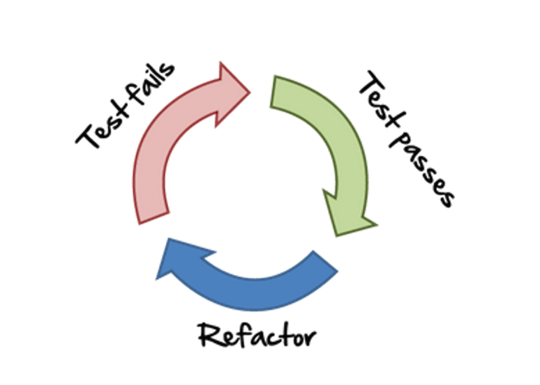
*
Ciclo Red-Green-Refactor [3].
*
 
La estructura cíclica del test-driven development garantiza que el código se transmita al sistema productivo únicamente cuando se hayan cumplido todos los requisitos del software. En otras palabras, los elementos del código se refactorizan y se vuelven a poner a prueba tantas veces como sea necesario, hasta que el test ya no dé errores. Esta estrategia permite enriquecer el software poco a poco con nuevas funciones, redactando nuevo código fuente tras cada test superado. Por este motivo, el TDD se considera un modelo incremental de desarrollo de software.
 
El concepto TDD no es nada nuevo, fue desarrollado por Kent Beck a finales de la década de los 90, cuando se comenzó a utilizar esta metodología de desarrollo [3].
 
Complicaciones que puede haber:
- Hay que pensar en lo que se quiere conseguir con el código y en cómo protegerlo para que no se rompa (probarlo).
- Tiene una curva de aprendizaje más pronunciada y es necesario aprender cómo refactorizar el código para mantenerlo limpio.
- Si el código existente que no está bajo prueba complica el mantenimiento y las nuevas incorporaciones. Hay que refactorizar el código existente para ponerlo bajo prueba.
 
## 3.2 Las distintas corrientes del TDD:
En el primer libro, Kent Beck, nos da unas series de pautas que podemos usar para hacer un mejor código y TDD. Entre ellas nos dice que, tenemos que hacer una lista de las pruebas que vamos a hacer ahora y otra de las futuras pruebas, porque él dice que no podemos abarcar todo el programa en una misma iteración. Un programa basado en las pruebas puede parecer estar escrito tanto de arriba abajo, porque se ha comenzado con prueba que representa un caso simple, como de abajo a arriba, porque se ha comenzado con pequeñas partes y luego se le van agregando partes más grandes.
 
Según Kent Beck ninguna de las dos describe realmente cómo es el proceso. Porque no podemos definir el proceso como algo vertical, si tuviéramos que hacer en todo caso sería algo como de lo conocido a lo desconocido. Por eso, no tenemos que abarcar todo el programa de una vez, sino tenemos que centrarnos en una funcionalidad haciendo pequeñas iteraciones.
Kent Beck en su libro no habla del **Outside-in**, porque no dice nada sobre los mocks, pero sí que habla del **Inside-out** pero no es puro, sino que son pequeñas iteraciones verticales de abajo-arriba desarrollando pequeñas pequeñas funcionalidades y no todas a la vez. 

### 3.2.1 Inside-Out
La escuela clásica (**Inside-Out**) se distingue por centrarse en la verificación del estado de los objetos, siendo por ello imprescindible que el contexto de los tests siempre deba estar formado por `objetos reales`, configurados previamente. Para la correcta generación de estos contextos se pueden crear clases que nos ayuden.
La existencia previa de estos `objetos reales`, implica que el diseño de nuestra solución irá creciendo poco a poco desde la base hasta la funcionalidad final. De ahí el sobrenombre de técnica **Inside-out**.
 
Aunque todos los desarrolladores deben tener en cuenta el panorama general, **Inside-out** permite que el desarrollador se concentre en una cosa a la vez. Cada entidad (es decir, un módulo individual o una clase única) se crea hasta que se construye toda la aplicación. En cierto sentido, las entidades individuales podrían considerarse inútiles hasta que no trabajen juntas, y conectar el sistema en una etapa tardía puede constituir un riesgo mayor. Por otro lado, centrarse en una entidad a la vez ayuda a paralelizar el trabajo de desarrollo dentro de un equipo.
 
Tomando el juego Tic-Tac-Toe como ejemplo, una solución podría incluir al menos tres entidades: un tablero, las notificaciones y un juego [4].
 
Usando el enfoque **Inside-out**, el `tablero` y las `notificaciones` se pueden identificar fácilmente como independientes, mientras que el `Juego` integra las entidades de todo el sistema.
 
El desarrollador se puede centrar primero en las entidades independientes, creando los tests y las funcionalidades de esas entidades. Todas las funcionalidades de las entidades independientes van a funcionar perfectamente ya que, no requieren ningún tipo de interacciones con alguna otra entidad. Con esto, el desarrollador está abordando una pieza aislada de funcionalidad a la vez. Pero cuando se trata del `Juego`, que es el nivel superior, todas las piezas deben estar juntas, con las entidades individuales interactuando entre sí.
 
Centrarse inicialmente en las entidades individuales hace que, el riesgo de que estas entidades no interactúen correctamente entre sí se lleva a una etapa posterior. Si las entidades no se comunican como se esperaba, se volverá a trabajar.
 
Esto demuestra que cuando se usa **Inside-out**, no se requiere una comprensión completa del diseño del sistema al principio. Solo es necesario identificar una entidad para comenzar. Los detalles internos de esa entidad surgen mediante el uso de pruebas unitarias específicas, lo que lleva a un diseño que se adhiere bien al Principio de Responsabilidad Única (SRP) `cada clase debe tener una única responsabilidad dentro de nuestro software, y esta responsabilidad debe estar definida y ser concreta. Todos los métodos deben estar alineados con la finalidad de la clase`.[5] En la etapa inicial, no siempre está claro qué comportamiento debe exponerse en una entidad. Esto podría dar como resultado que, se exponga más, o menos comportamiento de lo necesario.
 
|                                             Lo bueno                           |                       Lo malo                                          |
|                                            -----------                         |                    -----------                                         |
| Fácil para comenzar, ya que no tenemos que preocuparnos por las conexiones entre las distintas clases.              | Aunque sea fácil empezar, no es tan fácil decidir por dónde empezar. Si tenemos muchas entidades no tendríamos claro por donde se debería empezar el desarrollo, aunque haya que empezar las entidades en las primeras iteraciones no tenemos porque crearlas.    |
| Complejidad incremental, fácil de seguir.                                      | Cuando se hagan cambios en las capas bajas, eso puede suponer que en las capas superiores también hay que modificar el código y los tests. |
| Puede probar la integración entre las clases desde las primeras etapas de desarrollo.  | Puede conducir a un código algorítmicamente poco confiable (errores, básicamente)[6]. |
|                                                                                |Cada refactorización hacia abajo y hacia atrás reducirá involuntariamente la calidad del código, y altera los tiempos de entrega y los costes de desarrollo.    |
 
*
Tabla comparativa de lo bueno y lo malo de **Inside-out** [6]
*
                              
                              
### 3.2.2 Outside-In
La escuela de Londres **Outside-in** toma un enfoque distinto, centrándose en verificar que el comportamiento de los objetos es el esperado. El objetivo final es verificar si las interacciones entre objetos son correctas, y no el estado en sí mismo de los objetos. Mediante este enfoque podremos ahorrarnos todo el trabajo con los objetos reales (creación y mantenimiento) sustituyéndolos por mocks.
 
Con el **Outside-in**, podremos empezar por la funcionalidad final que se necesita, implementando poco a poco toda la estructura que da soporte a dicha funcionalidad. Por eso, esta técnica recibe el nombre de **Outside-in**, porque desarrolla las funcionalidades desde el exterior hacia dentro.
 
Las pruebas se basan en escenarios solicitados por el usuario, y las entidades están conectadas desde el principio. Esto permite que surja una API fluida, y la integración se demuestra desde el inicio del desarrollo.
 
Para enfocarse en un flujo completo desde el principio, se requieren conocimientos de cómo las diferentes partes del sistema interactúan entre sí. A medida que emergen las entidades, se mockean, este enfoque significa que el desarrollador necesita saber cómo probar las interacciones desde el principio, ya sea a través de un marco de simulación o escribiendo sus propias pruebas. Luego, el desarrollador retrocederá, proporcionando la implementación real de las entidades falsificadas o simuladas a través de nuevas pruebas unitarias.
 
Al usar **Outside-in**, el enfoque suele estar en cómo interactúan las entidades más que en sus detalles internos, de ahí el uso de pruebas de aceptación de alto nivel. Los detalles de la implementación del diseño están en las pruebas. Un cambio de diseño generalmente da como resultado que las pruebas también se modifiquen, por eso, las modificaciones de código tienen más riesgo o requerir más confianza para implementarlo.
 
También es importante remarcar el uso de la técnica del doble bucle [7]:
- Comenzamos por un test de aceptación que falle en el bucle externo, lo que nos guiará al bucle interno.
- En el bucle interno, que representa la metodología de trabajo TDD («Red-Green-Refactor»), implementaremos la lógica de nuestra solución.
- Realizaremos las iteraciones necesarias de este bucle interno hasta conseguir pasar el test de aceptación.
 
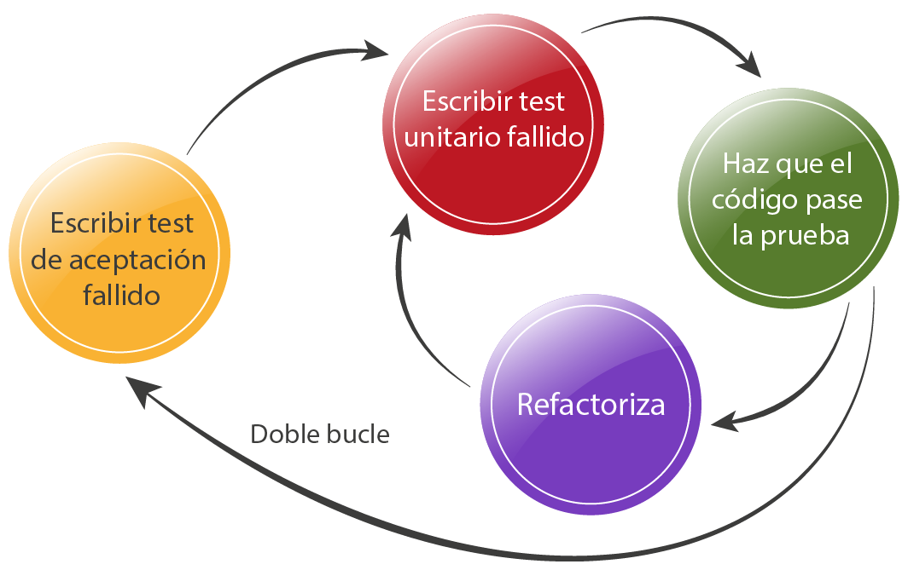
 
*
**Outside-in** doble bucle [8].
*
 
|                                             Lo bueno                           |                                Lo malo                                         |
|                                            -----------                         |                             -----------                                        |
| Se comienza desde los requisitos del usuario, es decir,  desde el principio de la funcionalidad tal y como se mostrará al usuario.                                                                          | No hay forma de que los eventuales cambios en cualquier capa se puedan evitar por completo. |
| Al bajar las capas, siempre podrá simular una conexión suelta hacia abajo, manteniendo así cada capa en una forma perfectamente comprobable y preservada. Lo que significa capacidad de mantenimiento y capacidad de cambio a nivel de componente. | Problema de actualizar el mock cuando cambia el comportamiento de la clase del mock. |
| TDD será tan fluido como con el enfoque **Inside-out**, pero además podrá aplicar BDD completo de todas las capas desde el principio.                                                                         | Puede conducir a un diseño de extremo a extremo rígido y quebradizo y, en ocasiones, a no cumplir con los requisitos del nivel del sistema [6].   |
|La API se puede adaptar a las necesidades del producto y no al revés.        |
 
 
*
Tabla comparativa de lo bueno y lo malo de **Outside-in** [6]
*                                                                                             
 
## 3.3 Experimentos
### 3.3.1 Experimentos en IBM y Microsoft
En 2008, se realizó el experimento [9] bajo la marca de Microsoft Research. El grupo de enfoque de la investigación fueron los equipos de **IBM** y **Microsoft**. Cuatro equipos usaban TDD y otros cuatro no. Todos los equipos eran similares entre sí en tamaño y velocidad. El experimento se realizó sobre proyectos `en vivo` que los equipos estaban desarrollando en ese momento.
Los equipos se seleccionaron en función de sus diferentes características:
- Tenía un nivel de experiencia de desarrollo diferente, de menor a mayor.
- Tenía un nivel de experiencia de dominio diferente, de menor a mayor.
- Utilizan diferentes lenguajes y entornos de programación: Java, C ++, .NET.
 
Tras finalizar los experimentos, hallazgos fueron realmente interesantes:
- Los equipos de TDD estaban creando software con menos errores.
    - Un equipo de `IBM` hizo un 40% menos de defectos que el equipo que no usaba TDD.
    - Otro equipo `Microsoft` hizo entre 60–90% menos defectos que los becarios que no usaban TDD.
- Los equipos de TDD dedicaron entre un 15% y un 33% más de tiempo a escribir el código.
- El aspecto importante para mejorar la calidad fue la creación de la infraestructura de prueba automatizada, pruebas unitarias, de integración y funcionales.
- Los equipos que continuaron usando TDD después del experimento, experimentaron una menor cantidad de defectos en la producción.
- La información interesante provino de un equipo de IBM que participó en el experimento. Después del experimento, algunos de los miembros del equipo dejaron de ejecutar las pruebas unitarias de regresión. La situación resultó en una mayor cantidad de defectos en la producción.

#### 3.3.1.1 Las críticas
En los experimentos que realizó IBM, se ve una clara diferencia en la cantidad de los tests unitarios realizados por los grupos que desarrollaban los distintos proyectos. El grupo que estaba haciendo el proyecto sin usar el TDD, no hizo los tests unitarios hasta finalizar el desarrollo. Los tests realizados después de la finalización fueron muy pobres y no tenían una buena cobertura. Por último, los tests de aceptación que tenían que pasar los proyectos no se basaron en los tests realizados por los grupos, sino en los tests que hizo otro grupo distinto basándose en los requisitos del proyecto.
 
Los equipos de Microsoft partían con un poco de ventaja, ya que los equipos hicieron reuniones para definir los requisitos. A las reuniones también asistió el equipo encargado de crear las pruebas de aceptación, que al final tenían que pasar los proyectos.  Microsoft tenía tres grupos distintos, uno de los grupos seguía el enfoque híbrido `Waterfall` de **Royce**, `que consiste en la creación de prototipos antes del proyecto final`. Otro equipo, tenía un código heredado y no siguió `ninguna técnica` de desarrollo, y el último, utilizó metodologías `ágiles con TDD`. No había medidas para ver qué proyectos pasaban más los tests, sólo se utilizó como medida, la cobertura de pruebas de cada proyecto.
 
Tanto en el proyecto de IBM como en los de Microsoft, no hay medida homologada o eficaz para determinar por completo cómo de bien funciona el TDD. Pero lo que sí podemos saber con estos experimentos es que, si se utiliza el TDD desde etapas tempranas en los desarrollos, estos proyectos luego tienen un menor coste de mantenimiento.
 
### 3.3.2 Experimentos de pares
Otro experimento [10] se llevó a cabo entre 24 desarrolladores de software experimentados que se enfrentaron en **pares**. Donde un par escribía el código usando el TDD y otro par no. Tres empresas diferentes participaron en la realización de las pruebas. Los autores del experimento prepararon 20 pruebas de caja negra para verificar los resultados. El experimento se hizo con los practicantes en su propio ambiente de trabajo. Sin embargo, hay cinco limitaciones importantes para la validez externa del experimento:
- El tamaño de muestra fue relativamente pequeño (6 pares de TDD, 6 pares sin TDD).
- Después de revisar los resultados del primer ensayo, se modificaron las instrucciones del experimento:
- Los desarrolladores del grupo sin TDD debían escribir pruebas automatizadas al finalizar la implementación del código.
- Todos los desarrolladores deben controlar los errores en condiciones.
- No se proporcionó a ninguno de los desarrolladores los casos de pruebas de aceptación.
A pesar de eso, solo 1 par del grupo sin TDD escribió pruebas que realmente mereciese la pena, todo esto a pesar de que se les instruyó específicamente para hacerlo.
- Dos de las organizaciones de desarrolladores profesionales, utilizaron el `pair programming` como práctica en su desarrollo de día a día, y el otro grupo ya estaba familiarizado con esta práctica. Por lo tanto, aunque no se requiere en TDD, se usó `pair programming` para preparar a los desarrolladores del experimento (para evaluar la eficacia de TDD en el desarrollo de día a día). Por eso, los resultados que se obtuvieron fueron de la combinación de `TDD` con `pair programming`.
- Cuarto, la aplicación utilizada en el proceso de evaluación fue muy pequeña (el tamaño típico del código era 200 LOC).
- Los desarrolladores de los experimentos tenían diferentes experiencias con TDD (de novato a experto). El tercer conjunto de los desarrolladores profesionales tenía solo tres semanas de experiencia con TDD antes del experimento.
 
Los hallazgos fueron:
- Las aplicaciones escritas por los desarrolladores de TDD pasaron en promedio un **18%** más casos de prueba de caja negra que las aplicaciones escritas por desarrolladores que no utilizaron TDD.

- > Después del experimento, el **87,5%** de los desarrolladores reconoció que TDD ayuda a comprender mejor los requisitos comerciales. El **95%** de los desarrolladores reconoció que TDD facilitó su trabajo al reducir el tiempo y la energía para la depuración [10].

#### 3.3.2.1 Criticas
En el experimento que se hizo con 24 desarrolladores, de los 6 pares que no usaban TDD solo un par hizo suficientes pruebas como para considerarlas válidas. Por tanto, sacar conclusiones viendo la cobertura de test y haciendo pasar al código pruebas de caja negra, no es muy fiable.
 
Después de los experimentos por pares, se preguntó a los desarrolladores sobre la productividad, efectividad y la dificultad de adaptarse al TDD.
- En cuanto a la productividad, la mayoría de los desarrolladores creyeron que el enfoque TDD facilita una mejor comprensión de los requisitos y reduce el esfuerzo de depuración.
- > Sobre la efectividad, el **92%** de los desarrolladores creyeron que TDD produce un código de mayor calidad, el **79%** pensó que TDD promueve un diseño más simple y el **71%** pensó que el enfoque era notablemente eficaz. Por lo tanto, la media de estos porcentajes indica que el **80%** pensó que TDD es efectivo [10].
- En cuanto a las dificultades en adaptarse al enfoque, casi la mitad de los desarrolladores profesionales pensaron que meterse en la mentalidad de TDD fue difícil, una minoría indicó que la falta de la fase de diseño inicial en TDD fue un obstáculo. Por lo tanto, tomando promedio de las respuestas, el 40% de los desarrolladores pensaron que el enfoque enfrenta dificultades en la adopción.
 
 
## 3.4 Resumen: ¿Vale la pena TDD?
Tras los experimentos de **Microsoft** y **IBM** [9] indican que, TDD es aplicable en varios dominios y puede reducir significativamente los defectos de desarrollado software, sin una reducción significativa de la productividad del equipo de desarrollo. Además, un aspecto importante de TDD es la creación de activos de prueba: unidad, funcional y pruebas de integración. Los lanzamientos futuros de estos productos, a medida que continúen usando TDD, también experimentarán bajas densidades de defectos debido al uso de estos activos de prueba.
 
Tras los **experimentos por pares** [10], se hicieron encuestas a los desarrolladores para ver lo que pensaba del TDD. En promedio, el **80%** de los desarrolladores profesionales sostuvieron que TDD fue un enfoque efectivo y el **78%** creía que el enfoque mejora la productividad de los programadores. 
 
Viendo los resultados obtenidos en los experimentos podemos decir que el TDD, ayuda al desarrollo, a la creación de un código limpio y después ayuda al mantenimiento y la incorporación de nuevas funcionalidades. Pero estos resultados obtenidos pueden cambiar dependiendo del proyecto y de los desarrolladores, por tanto, no podemos asegurar que el TDD vaya a funcionar en todos los casos. Por eso, antes de aplicar TDD lo recomendable sería revisar si de verdad merece la pena usar el TDD en ese proyecto.
 
## 4. Aplicación y problemas encontrados
En los desarrollos del backend, se decidió usar **Inside-out** para `SecretCombination` y `ProposalCombination` y **Outside-in** para el `Result`. Para el frontend, se decidió usar **Outside-in** para el desarrollo de `BoardComponent` y `ProposalCombinationComponent` y **Inside-out** para el `Result`.

### 4.1 Backend
Para el desarrollo del Backend se han seguido las indicaciones del libro de Kent Beck, donde dice que no hay que hacer desarrollos de todas las funcionalidades de manera horizontal, sino que hay que desarrollar una pequeña funcionalidad e ir subiendo hacia arriba haciendo desarrollos verticales.
 
Además, al tener distintas funcionalidades, se han seguido distintos enfoques para el desarrollo. Para la primera funcionalidad, se usó el TDD puro. Escribiendo el test para que falle primero, luego implementar el código mínimo para que pase el test, después escribir el test para el funcionamiento y el código de ese funcionamiento.
Nada más empezar el desarrollo incumplimos una de las cosas que nos dice en el libro, y es que, nos indica que no hay diseñar y eso es algo imposible de cumplir. Ya que nada más empezar a desarrollar se diseña, incluso antes de empezar cuando decidimos qué tecnología usar, incluso cuando elegimos por dónde empezar, front o back, ya estamos diseñando. Cuando Kent Beck dice que no hay que diseñar, se refiere a no hacerlo sobre el papel haciendo diagramas antes de empezar. El no diseñar supone un gran problema, ya que, para empezar a desarrollar hay que tener un mínimo de diseño previo, aunque no sea sobre el papel. Al tener un diseño previo, evita que luego tengas que rediseñar la aplicación cuando estás desarrollando, eso fue uno de los problemas que tuvimos cuando estábamos haciendo el desarrollo, porque empezamos haciendo el desarrollo de una funcionalidad, y en la siguiente iteración vimos que, para juntar esa funcionalidad con la otra, había que cambiar el diseño de esta. Por eso, tener un mínimo de diseño previo nos ayuda con el desarrollo.
 
Otro de los problemas de no diseñar fue que, no sabíamos por dónde empezar, aunque se diga que hay que empezar desde lo más abajo, eso es muy ambiguo. Porque cómo no tienes un diseño, puedes empezar desde lo que sería más abajo de verdad que serían las entidades. La siguiente imagen muestra como sería de arquitectura si empezamos desde las entidades:
 
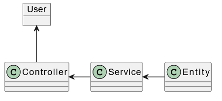
*
Imagen de la arquitectura si empezamos desde `Entity`
*
 
O también puedes empezar desde los servicios ya que no tiene por qué haber una entidad. La siguiente imagen muestra como sería de arquitectura si empezamos desde las servicios: 
 
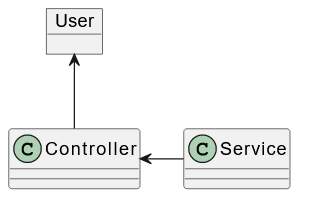
*
Imagen de la arquitectura si empezamos desde `Service`
*
 
También puedes empezar directamente desde el controlador, porque hasta que no tengas una segunda funcionalidad que desarrollar, no necesitas un servicio o una entidad. El controlador puede tener directamente el código de la primera funcionalidad, y no hacer ninguna llamada a una clase de más abajo. La siguiente imagen muestra como sería de arquitectura si empezamos desde el controller:
 
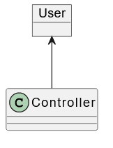
*
Imagen de la arquitectura si empezamos directamente desde `Controller`
*
 
Las tres opciones serían igual de válidas, porque si empezamos desde el controlador, en la primera funcionalidad no necesitamos crear ningún tipo de objeto concreto para devolverlo, directamente podríamos devolver la respuesta creando el objeto básico en el mismo controlador. Para la opción de crear un servicio para devolver el objeto, podría tener exactamente la misma funcionalidad que el controlador sin tener que crear ningún tipo entidad concreta, se podría mapear y crear el objeto directamente en el Service y devolverlo. No sería necesario crear una entidad, hasta que haya que hacer otra funcionalidad y devolver el mismo tipo de objeto, porque si no creamos una entidad tendríamos mucho código duplicado. Incluso teniendo código duplicado, no hay una necesidad real de crear una entidad hasta que no tengamos que cruzar esa entidad con otra para crear un objeto en conjunto. Por eso, el no tener un diseño previo puede complicar mucho el desarrollo si no has empezado desde el sitio correcto.
 
Debido a esto de no diseñar tuvimos un problema, en la segunda iteración haciendo el `ProposalCombination`, hubo que modificar el código implementado en la primera iteración sobre el `SecretCombination`. Si hubiéramos tenido un primer diseño, no habríamos tenido que modificar el código ya implementado, debido a esto también hubo código que se quedó obsoleto.
 
#### 4.1.1 Técnicas de desarrollo
Para la primera funcionalidad hicimos el TDD siguiendo el libro de Kent Beck, pero vimos que para desarrollos tan pequeños como el nuestro había algunos pasos intermedios que eran innecesarios. El TDD puro está más orientado a proyectos complejos donde la lógica de negocio sea compleja, para proyectos pequeños hacer este tipo TDD puede ser un inconveniente, ya que en lugar de ayudar puede hacer que perdamos el tiempo en pequeñas interacciones, tales como en las que tengamos que devolver un valor predefinido. En estos casos, hacer muchas iteraciones nos hace perder el tiempo. Ya que, tendríamos que hacer primero una interacción dónde creamos el test que va a fallar, tal y como se muestra en la siguiente imagen
 
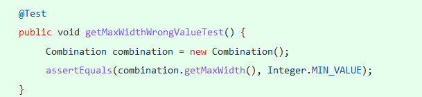
*
Imagen del primer test que va a fallar
*
 
y el código mínimo para que ese test pase. Luego tendríamos que hacer una siguiente iteración donde creamos el código para devolver un valor nulo, como se puede ver en la siguiente imagen:
 
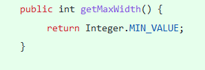
*
Imagen del código mínimo para pasar el test
*
 
Una última iteración dónde ya devolvemos el valor que se ha decidido de antemano. En las siguientes imagen podemos ver el test final y su código correspondiente: 

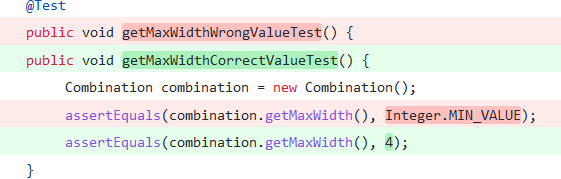
 *
Imagen del test final
*

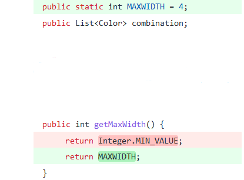
 *
Imagen del código final para pasar el test
*

Por eso, en estos casos hacer el TDD puro nos puede hacer perder tiempo y es más adecuado no hacer el TDD.
 
Para el desarrollo de la segunda funcionalidad, teniendo en cuenta las conclusiones sacadas de la primera iteración, se decidió no hacer el TDD estricto. En lugar de hacer un commit después de cada iteración, se decidió a hacerlo después de desarrollar la mini funcionalidad completa. Al hacer esto vimos que, para esta funcionalidad se mejoró el tiempo de desarrollo, pero ese tiempo de desarrollo se vio afectado por no tener un diseño previo y tener que modificar el código ya existente para incorporar la nueva funcionalidad.
 
Para la última y la tercera funcionalidad, se decidió cambiar de enfoque del desarrollo. En lugar de hacer **Inside-out**, se decidió hacer **Outside-in** para que de esta manera tener los dos puntos de vista y ver cómo afecta al desarrollo.
Al usar el enfoque **Outside-in**, nos dimos cuenta de que, aparte de crear los mocks también habrá que factorizar bastante el código, ya que no siempre podemos tener un test con el que poder probar desde la clase de fuera la funcionalidad de la clase de dentro. Por ello, tenemos que factorizar la de fuera para hacer la llamada al método de la clase de dentro para obtener el dato y poder quitar el mock.

#### 4.1.2 Las dudas del backend
Haciendo este desarrollo nos surgieron las siguientes dudas:
- La primera de las dudas es, ¿cuánto código debe ser probado? Puede haber casos que solamente nos retornan un valor predefinido, entonces, ¿es necesario probar ese código?
- Otra de las dudas es, ¿qué tipo de test se tienen que hacer para probar los controladores? Los controladores tienen la función de entrada y salida de datos, entonces, ¿se debería probar este controlador solo con test unitarios? ¿O también con los tests de integración que prueben todas las funcionalidades implementadas de los servicios y de las entidades? ¿O por el contrario, los tests de integración no harían falta? Ya que, haciendo el desarrollo de los servicios y las entidades con TDD ya hemos probado esas funcionalidades.
- La última duda fue, ¿podríamos crear un mini framework para las pruebas de los controladores y los servicios? Ya que, en muchos casos los tests son muy similares, lo único que hay que probar es la entrada y la salida de esos datos después de haberles aplicado la lógica de negocio.
 
#### 4.1.3 Conclusiones
Haciendo el desarrollo **Inside-out** nos hemos dado cuenta de que, aunque no hemos tenido que crear mocks como en el caso de **Outside-in**, sí hemos tenido que modificar el código ya implementado en varias ocasiones, ya que al no haber un diseño previo, no podemos saber cómo va a afectar el nuevo código al ya existente. Al final, podemos pensar que al usar **Inside-out**, nos estamos ahorrando el tiempo que tardamos en implementar los mocks, pero no es así, ya que, podemos perder el mismo tiempo adaptando el código ya implementado al nuevo código.
 
### 4.2 Frontend
Para el desarrollo del Frontend al tener distintas funcionalidades, hemos decidido cambiar la técnica de TDD que usamos. Para ver cómo afecta a los tiempos de desarrollo y a la dificultad, si hacemos **Outside-in** con TDD puro, **Outside-in** con un TDD más adaptado a nuestro proyecto e **Inside-out**.
 
**Outside-in**, esta técnica consiste en empezar a hacer el desarrollo desde los elementos más cercanos al usuario. En este caso, esos elementos serían las pantallas que vería el usuario para interactuar con nuestra aplicación. Hemos hecho desarrollos verticales desde el usuario hasta el backend, en lugar de hacer desarrollos horizontales con todas las funcionalidades. Para el **Inside-out** en esta aplicación la parte más interna sería el `BoardService`, encargado de conectar el frontend con el backend.
 
 
#### 4.2.1 Técnicas de desarrollo
Empezamos el desarrollo con el SecretCombination, que consiste en mostrar una combinación secreta que recuperamos desde el backend y lo mostramos al usuario. Para esta funcionalidad usamos el TDD puro, haciendo un commit por cada test y su código correspondiente. Al tratarse del Frontend, incumplimos otra de las normas que tenemos para hacer desarrollos con TDD, la norma del código mínimo, ya que para pasar el test tenemos que implementar código tanto en los componentes como en los archivos HTML y CSS. Como se muestra en la siguiente imagen.
 
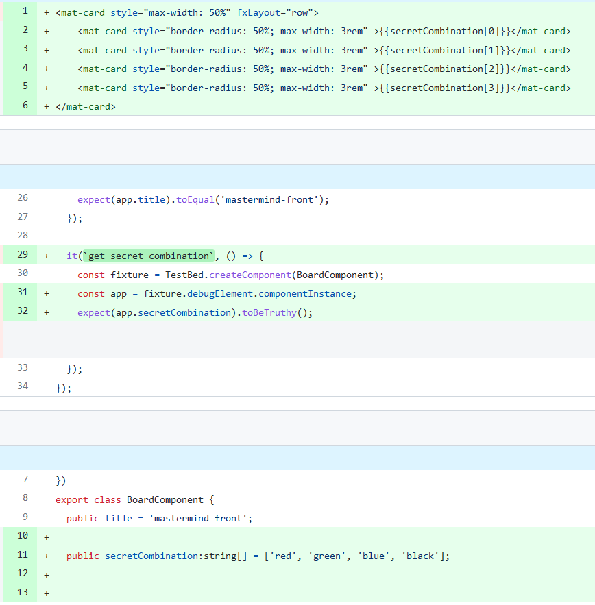
  *
Imagen del commit con test y su código mínimo en el componente y HTML
*

Para el desarrollo del frontend hemos usado `Angular` con `TypeScript`, para la cobertura de los tests `Karma` y para el testing los componentes propios de `Angular`. Haciendo el desarrollo del frontend con el **Outside-in**, da la sensación de que avanzamos bastante, ya que, aunque se haga el código mínimo para pasar el test, ese código incluye elementos tantos del HTML como del componente. Por eso, vamos avanzando más de cara al usuario que si hacemos un desarrollo basado en **Inside-out**, dónde la mayoría del código que se implementa, el usuario no lo llega a ver. Aunque el tiempo que se tarda en implementar este código mínimo es bastante mayor, porque hay que implementar tanto el código cómo los datos mokeados que vamos a usar hasta que podamos conectar nuestra aplicación con el backend.
 
Para la segunda parte del desarrollo decidimos no seguir un tdd puro, sino uno más adaptado a nuestro proyecto. La segunda parte consistía en el desarrollo de ProposalCombination, en este desarrollo nos centramos en recoger la proposición de colores que introducía el usuario y mandarlo al backend. Para ello, empezamos mostrando dos columnas, una vacía y otra con distintos colores de los que podía elegir el usuario. Luego cuando el usuario añade los colores, se muestran esos colores en la pantalla y se mandan al backend para añadirlos al tablero. Hasta este punto, todos los tests fueron creados en el componente `proposal`, después de esto conectamos el componente `proposal` al componente `Board`, para actualizar el tablero con la nueva proposición que se ha añadido. Para ello, tuvimos que crear y modificar los tests y el código que ya teníamos implementado en el componente `Board`. Para esta parte en lugar de hacer un TDD puro, adaptamos el TDD partiendo de la experiencia que teníamos del desarrollo del backend, donde sabíamos que, al modificar el código ya existente tendríamos que modificar algún test. Por eso, para esta parte en el commit se incluyó el código modificado, el nuevo test para ese código y en caso de que hubiera, el test modificado que fallaba con el código modificado.
 
En la tercera parte decidimos cambiar del enfoque de **Outside-in** a uno de **Inside-out**, para ver cómo afecta al desarrollo del Frontend. La parte más interna de nuestra aplicación front para este enfoque sería el servicio que conecta la aplicación frontend con el backend.
 
Por eso, empezamos creando un método que nos devolviera el resultado, pero los datos que nos devolvía fueron mockeados hasta que conectamos nuestra aplicación con el backend. Luego creamos el objeto Result e hicimos que ese método devolviese el objeto. Una vez que terminamos el funcionamiento de obtener el resultado, la siguiente funcionalidad que decidimos cambiar fue la de añadir una `ProposalCombination` y obtener el resultado. Al cambiar esta funcionalidad, nos dimos cuenta de qué habían otros test estaban fallando y tuvimos que cambiarlos y adaptarlos al nuevo código. Al cambiar el método en el `BoardService`, no solamente afectó a los tests sino también al método encargado de añadir la propuesta en el `ProposalComponent`. Pero en esta iteración, decidimos cambiar el mínimo de código para evitar errores de compilación. Al hacer esto, vimos que la funcionalidad de nuestra aplicación se vio afectada ya que no habíamos adaptado el código a lo que nos venía del `BoardService`. Fue en la siguiente iteración, donde decidimos añadir nuevos tests para corregir el funcionamiento del `ProposalComponent`.
 
Después de esto, la siguiente funcionalidad que empezamos a desarrollar desde el `BoardService`, era la de empezar un nuevo juego. Para ello, al principio devolvemos un mock de `Board`, y luego conectamos esta funcionalidad con el backend para obtener un nuevo Board y quitar el mock. Después de esto, añadimos nuevos test y código en BoardComponent para ver si el juego se ha terminado o no, y en caso de que sí haya terminado el juego, hacer la llamada al backend para empezar un nuevo juego. 
 
#### 4.2.2 Las dudas del frontend
Las dudas que nos han surgido haciendo este desarrollo de la parte de Frontend son:
- ¿Cuánto del código implementado hay que probar?, haciendo el desarrollo nos hemos dado cuenta de que el TDD está más orientado para desarrollos en lenguajes de programación orientado a objetos.
- Si estamos haciendo el desarrollo del Frontend y no podemos cumplir la regla del código mínimo, entonces, ¿de verdad estamos haciendo TDD o es solo desarrollo basado en TFD (Test First Development)?
- Si nos toca cambiar el código HTML pero no tenemos cobertura de test para eso, y cambiamos ese código, ¿seguiría siendo TDD, una refactorización o sería desarrollo normal?
 
#### 4.2.3 Conclusiones
Haciendo este desarrollo, nos hemos dado cuenta de que el TDD no está pensado para hacer desarrollos con lenguajes no orientados a objetos. Concluimos que hay unos cuántos aspectos que no están claros, como, por ejemplo, cuando hacemos el desarrollo del frontend siguiendo el TDD no tenemos ningún tipo de instrucción sobre cómo implementar el código HTML y CSS.
 
## 5. Desarrollo y aplicación final
Para el desarrollo de esta aplicación hemos usado distintas tecnologías, para el `Backend`, hemos usado `Spring-Boot` con `Maven` y para el desarrollo de los tests unitarios ´jUnit´ con ´Mockito´ y `Rest-assured` para los tests de integración. No tenemos una base de datos, ya que esta aplicación solamente nos permite jugar a una partida de Mastermind sin la posibilidad de guardar nada. Lo hemos hecho de esta manera, porque nos hemos centrado más en investigar y hacer el desarrollo con TDD, que en la propia aplicación.
Para el desarrollo de `Frontend` hemos usado `Angular Material` con `TypeScript`, para los tests unitarios la propia herramienta de `Angular` y hemos usado `Karma` para saber la cobertura de los tests.
 
### 5.1 Backend
#### 5.1.1 SecretCombination
Para la primera funcionalidad decidimos usar el TDD puro con la técnica de **Inside-out**.
La funcionalidad que desarrollamos fue la de SecretCombination, empezamos creando el enumerado `Color`, esté enumerado tiene todos los colores que vamos a mostrar y con los que vamos a jugar nuestro juego de `Mastermind`. La clase que creamos después del enumerado `Color`, fue la clase `Combination` que tiene un array de uno a cuatro colores y la funcionalidad de devolver este array. La siguiente clase fue la de `SecretCombination` que extiende la clase `Combination`, y por ahora solamente tiene una funcionalidad y es tener una combinación secreta aleatoria de cuatro colores. Después de `SecretCombination`, creamos la clase `Board`, este Board por ahora tiene SecretCombination y la funcionalidad de devolverlo. Al final, creamos el servicio y el controlador para la clase de Board. La arquitectura de este punto se muestra en la siguiente imagen:
 
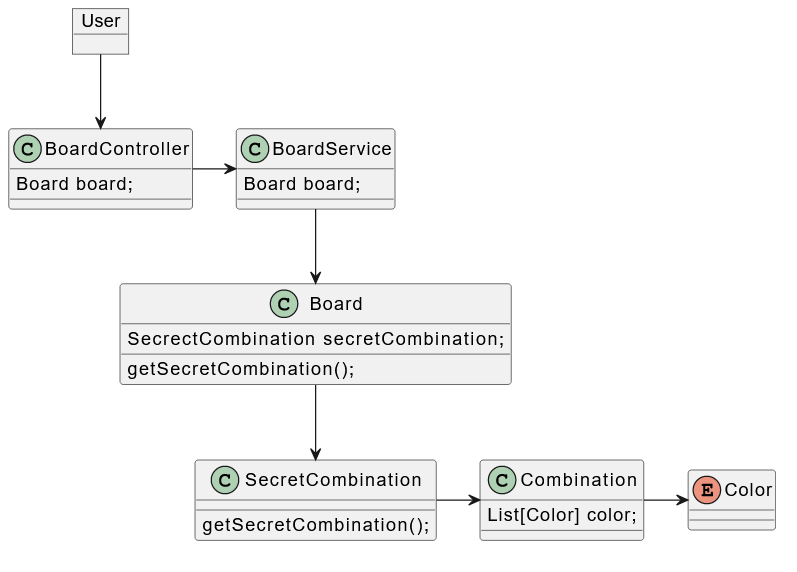
 *
Imagen de la arquitectura después de la primera iteración de `SecretCombination`
*

Hemos decidido seguir este camino porque es el que nos ha parecido más correcto de cara a los próximos desarrollos. Pero este no es el único camino que podíamos haber seguido, podríamos haber empezado directamente por el `SecretCombination` y que devolviera los colores sin un enumerado. Ya que hasta este punto no tenemos la necesidad de crear un enumerado de colores o la clase Combination, pero decidimos crear estas clases ya que, sabemos que en el futuro vamos a tener otra clase `ProposalCombination` qué va a usar la clase combination, por eso decidimos crearlos de antemano para no tener que volver a modificar y adaptar el código. En primera funcionalidad, también podríamos no haber creado la clase `Board`  y devolver directamente el `SecretCombination` usando el `Service` y el `Controlador`, pero por la misma razón de no volver a modificar el código y que lo vamos a necesitar en el futuro decidimos crear esta clase.
 
#### 5.1.2 ProposalCombination
Para la segunda funcionalidad usamos un TDD más adaptado a nuestra aplicación, donde no hacíamos un commit después de cada pequeña funcionalidad, sino después de haber desarrollado toda la funcionalidad de un método al completo.
La segunda funcionalidad que decidimos desarrollar fue la de `ProposalCombination`, esta clase extiende a la clase `Combination` y devuelve la lista de colores que tiene. Luego modificamos la clase `Board`, para añadirle otros dos nuevos atributos, un `array` de `ProposalCombination` y el `actualIntent`. También hemos añadido las funcionalidades de obtener estos dos atributos, y de poder añadir una combinación de colores indicada por el usuario, al array de `ProposalCombination` del Board.
 
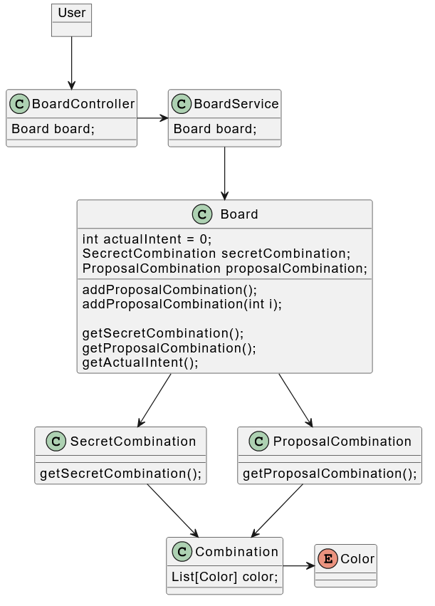
*
Imagen de la arquitectura tras añadir `ProposalCombination`
*

#### 5.1.3 Result
Para el desarrollo del Result en el backend se ha cambiado la forma de hacer el desarrollo, hasta ahora se usaba **Inside-out**, pero para este desarrollo hemos decidido usar **Outside-In** mockeando los datos.
 
Aquí no tenemos el problema de saber por dónde empezar. ya que la parte más exterior de nuestra aplicación backend era el controlador. Empezamos el desarrollo creando un método que nos devuelva el resultado, para ello al no tener un objeto `Result` devolvimos un objeto de tipo `Map`. Fuimos mockeando los datos y de controlador pasamos al servicio, donde también creamos un método que nos devuelva el objeto Map. Después refactorizamos el `BoardController` para conectarlo con el `BoardService`, y de esta manera usar el método de obtener el mock de `Result` desde el Service y quitarlo del Controller. Fuimos creando métodos para obtener el resultado y refactorizando hasta llegar a crear el objeto `Result`.
 
Una vez creado el objeto `Result`, empezamos a modificar el método de añadir una `ProposalCombination`, para que, al añadir nos devuelva un objeto `Result`. Tuvimos que ir mockeando la respuesta hasta llegar al objeto `Board`, donde se llama al `SecretCombination` para tratar el `proposalCombination` comparándolo con la combinación secreta aleatoria de cuatro colores, y generar una respuesta.
 
Por último, empezamos desde el controlador a crear el método encargado de empezar un nuevo juego. Este método tiene la única funcionalidad de crear un nuevo `Board` que a su vez crea un nuevo SecretCombination.
 
Haciendo el desarrollo **Outside-in** nos hemos dado cuenta de que aparte de mockear los datos, hay que refactorizar y modificar los tests bastante más qué el **Inside-out**. Es casi el doble de veces que tenemos que modificar los tests, ya que la primera vez tenemos que estar mockeando los datos hasta que lleguemos a crear el objeto que vamos a devolver. En las siguientes iteraciones, tenemos que cambiar el código y los tests para devolver ese objeto creado, por tanto, tenemos que volver a modificar casi todos los tests, hasta el nivel más bajo. En la siguiente imagen mostramos la arquitectura final de nuestro backend
 
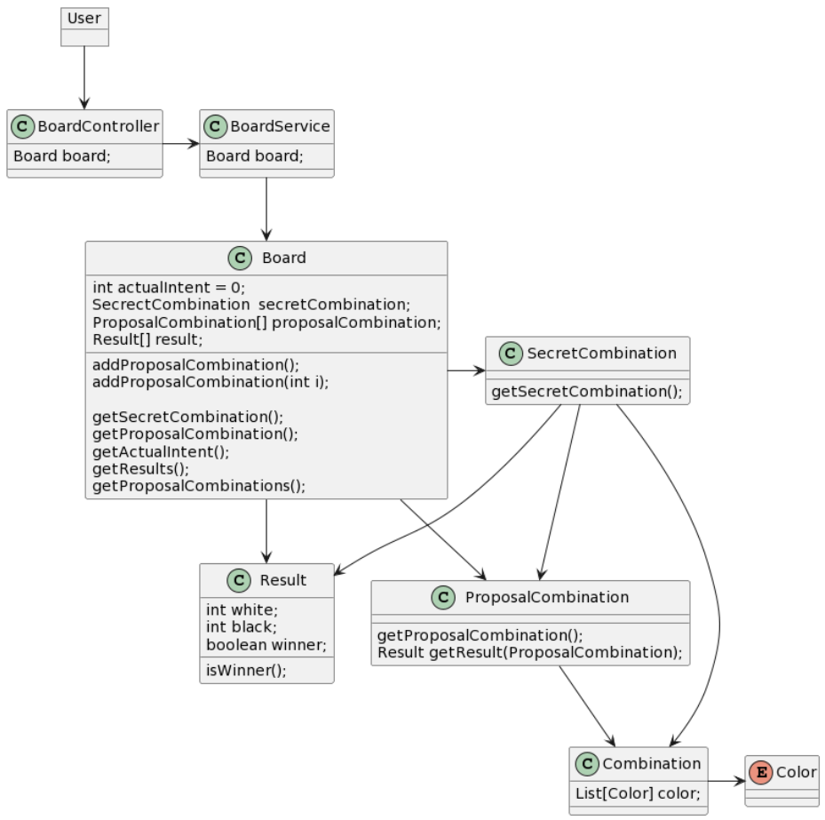
 *
Imagen de la arquitectura final
*

### 5.2 Frontend
#### 5.2.1 SecretCombination
Para la primera funcionalidad del frontend, decidimos usar el TDD puro con la técnica de **Outside-in**.
La primera funcionalidad del frontend desarrollamos también fue la del SecretCombination, se hizo de esta manera para poder seguir con la indicación que nos daba Kent Beck en su libro. decía que, había que desarrollar una funcionalidad desde lo más abajo hasta el usuario de manera vertical.
 
Empezamos creando la clase `Board` que tiene como atributo `SecretCombination`, también hemos creado el `BoardComponent`, el `HTML` y el `CSS` correspondiente a esta clase. Al principio del desarrollo el componente Board sacaba sus datos de un mock, pero luego creamos el servicio para el `Board` y lo conectamos al backend, para que de esta manera los datos obtenidos fueran reales. No hemos creado una clase `SecretCombination`, ya que, solamente la vamos a mostrar y no vamos a hacer ningún otro tipo de gestión con ella. Por eso, la hemos creado como atributo de la clase `Board` que es a su vez un objeto que tiene una combinación y maxWidth.
 
#### 5.2.2 ProposalCombination
Para la segunda funcionalidad, siguiendo el ejemplo del backend decidimos usar un TDD más adaptado a nuestra aplicación, haciendo un commit por la funcionalidad completa del método.
Para el `ProposalCombination` sí que creamos un componente aparte, ya que no solamente vamos mostrarlo al usuario, sino que también lo tenemos que mandar al backend dónde lo vamos a añadir a la lista del `Board`, y compararlo con nuestra combinación secreta. Esta clase `ProposalCombination` se añadió a la clase `Board` como un array de `Proposal`. `Proposal` tiene como atributos la combinación y maxWidth. Hemos refactorizado la clase `Board` para cambiar el `SecretCombination` y que sea de tipo `Proposal`.
 
#### 5.2.3 Result
Para el desarrollo de la funcionalidad del Result en el Frontend, en lugar de hacer un desarrollo **Outside-in** hemos hecho **Inside-out**.
 
Empezamos desarrollando los tests y el código para el funcionamiento de obtener el resultado y de añadir una `ProposalCombination` en el `BoardService`. La segunda parte de nuestra aplicación front, eran los componentes que se encargaban de recoger los datos y mostrarlos en el HTML. Por eso, primero nos centramos en recoger el resultado y mostrarlo en el `ProposalCombinationComponent`. Una vez que se mostraba bien el objeto que habíamos recuperado, hicimos que ese objeto volviese al `Board` principal en el componente `BoardComponent`.
 
Una vez que tenemos conectada nuestra aplicación frontend con el backend, implementamos los métodos encargados de revisar si el juego se había terminado, y en tal caso, llamar al backend para empezar un nuevo juego con un nuevo Board.
 
### 5.3 Aplicación final
La aplicación tiene dos partes, el `frontend` y el `backend`. El backend está compuesto por cuatro componentes, el `Board`, el `SecretCombination`, el `ProposalCombination` y el `Result`. Y el frontend está compuesto por dos componentes el `BoardComponent` y el `ProposalCombinationComponent`.
 
El backend se encarga de generar una combinación secreta y guardarla en el tablero. Luego el usuario para adivinar esa combinación introduce una propuesta, al comparar estas dos combinaciones se crea un resultado, tanto el resultado como la propuesta del usuario se guardan en el tablero hasta el número máximo de intentos permitidos. Una vez que una partida ha terminado, ya sea porque el usuario ha conseguido adivinar la combinación secreta, o que ha alcanzado el número máximo de intentos permitidos, el usuario puede crear una nueva partida. La creación de esta nueva partida consiste en crear una nueva combinación secreta y restablecer a cero el número de intentos, las propuestas y las respuestas.
 
En el frontend, el usuario puede ver el tablero con las propuestas y los resultados de esas propuestas. También puede añadir una propuesta eligiendo los distintos posibles colores. Después de haber añadido una propuesta, si el usuario ha acertado o ha perdido la partida, ya que ha alcanzado el número máximo de intentos, se muestra un pop-up con la combinación secreta indicando si ha ganado o ha perdido. Para ver si el usuario está cerca de adivinar la combinación secreta, en el resultado se muestran dos colores, el blanco y el negro. Se muestra el color blanco, por el número de colores acertados en posiciones equivocadas, y el color negro, indica el número de posiciones y colores acertados siendo la suma máxima de estos dos, 4. En las siguientes imágenes se muestran las distintas pantallas de nuestra aplicación:  
 
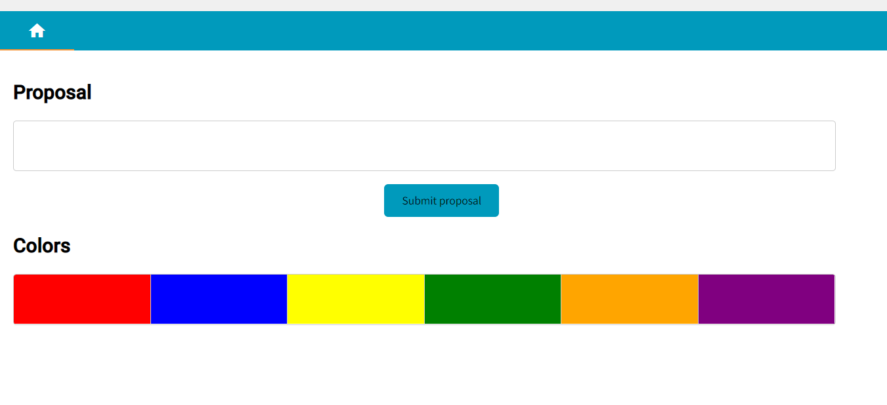
*
Pantalla Inicial
*
 
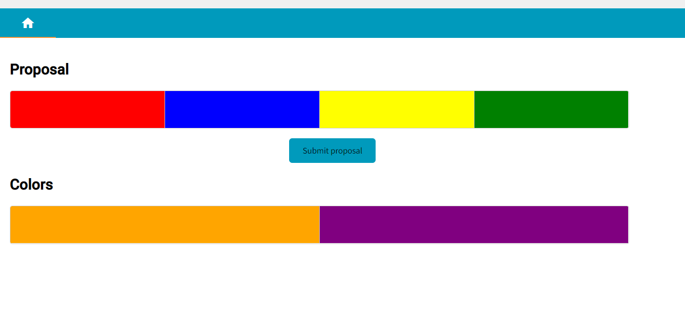
*
Pantalla propuesta
*
 
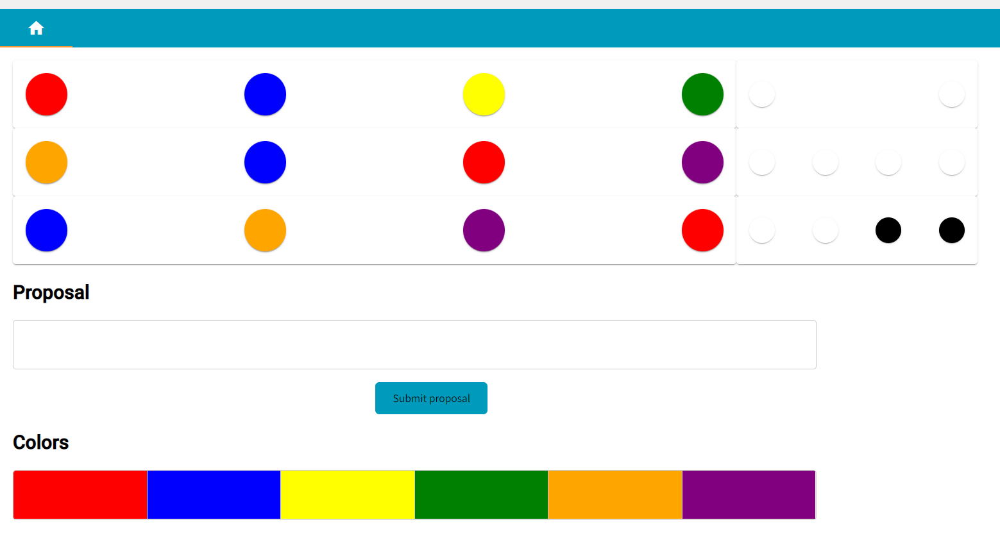
*
Pantalla resultado
*
 
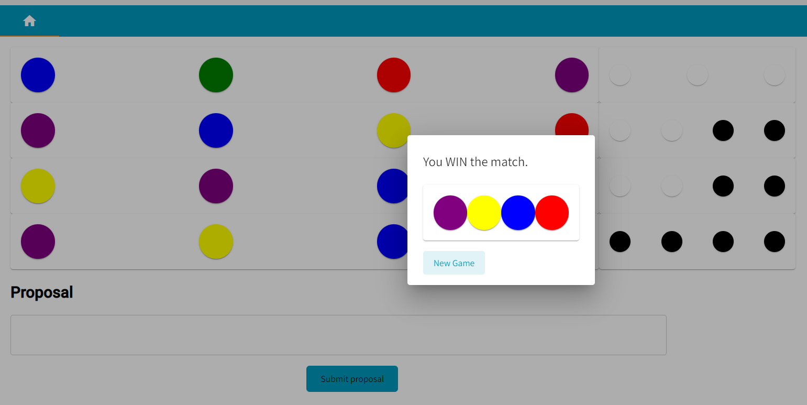
*
Pantalla final
*
 
## 6. Conclusiones
### 6.1 Conclusiones generales
Haciendo el desarrollo con TDD, nos hemos dado cuenta de que hay bastantes lagunas respecto a la forma de hacer el desarrollo. 

En `primer` lugar, no está muy claro qué tipo de tests tienen que ser los que prueben nuestro código, tampoco está claro qué parte del código debe ser probado. ¿Tenemos que probar todo el código y todos los métodos (get, set, negocio), o podemos no probar los métodos simples de gets y los sets? Tampoco deja claro qué hacer en caso de que escribamos código que no puede ser probado(CSS, HTML…), ¿tenemos que seguir haciendo TDD para escribir esa parte del código o podemos no hacerlo?
 
En `segundo` lugar, hemos visto que el TDD está muy orientado a las personas con bastante experiencia escribiendo código. Ya que, empezar a escribir el código sin tener un diseño previo, no es nada fácil, a no ser que tengas bastante experiencia, y que solamente con saber los requisitos seas capaz de diseñar en tu mente, cómo quedaría la estructura de las clases de la aplicación.
 
En `tercer` lugar, para los desarrollos **Inside-out** no se indica exactamente desde donde se debería empezar a desarrollar, lo que hace que los programadores poco experimentados puedan tener problemas luego. Puede que tengan que modificar algunas de las clases ya implementadas, por no empezar por el sitio correcto.
 
En `cuarto` lugar, hemos visto que tampoco se indica nada sobre qué hacer, cuando al escribir el test y su código, hacen que otro test ya implementado falle. En estos casos, lo que podríamos hacer es, o bien seguir desarrollando el test y el código, y dejar el test que ha fallado y luego en la siguiente iteración corregir ese test. O bien, lo que podríamos hacer es que, ya que sabemos que el test que vamos a implementar va a hacer que otro test falle, podríamos primero adaptar ese test para qué al implementar el nuevo y su código, éste no falle. Tampoco deja claro qué hacer en caso de que necesitemos el código de otra clase y ese código todavía no está implementado. En el libro se indica que, si estamos desarrollando la clase `a` y necesitamos el código de la clase `b`, entonces la clase `b` deberá ser probada en la clase `a`. Pero no se indica el orden en el que se tienen que desarrollar, se da suponer que primero se desarrollaría la clase `b` sin probar y luego se usaría ese código en la clase `a` probando así las dos clases. Pero de esa manera no estaríamos haciendo el TDD, porque en TDD se escribe antes la prueba que el propio código. Tenemos que hacerlo de esta manera ya que, si desarrollamos primero la clase `a` entonces no tendríamos disponible el código de la clase `b`, y tendríamos error al compilar la aplicación lo que no nos dejaría avanzar en el desarrollo. Pero este enfoque de desarrollar sin probar nos deja con otro problema, y es, ¿qué hacer si el código de la clase `b`, que hemos implementado sin probar, falla? Tenemos que corregirlo en una iteración sin TDD o tenemos que hacerlo usando TDD y mientras probamos el código de la clase `a`.
 
En el `quinto` y último lugar, hacer el desarrollo TDD en cualquiera de sus dos variantes tiene sus propios inconvenientes. Si hacemos **Inside-out**, el inconveniente es que, al no tener un diseño previo, luego en las etapas más avanzadas podemos tener que modificar el código ya implementado y los tests correspondientes a ese código. Y haciendo el desarrollo con **Outside-in**, el inconveniente es que al empezar por arriba tenemos que mockear las clases de abajo. En las etapas más avanzadas de desarrollo, tenemos que modificar algunos de estos mocks, y el código o los tests asociados a este que fallen, ya que no los hemos adaptado a los nuevos mocks. También tenemos, que cuando hayamos creado ya el objeto, tenemos que volver a modificar todos los tests y el código haciendo que éste usé el objeto creado.

### 6.2 Conclusiones personales
Este proyecto ha supuesto un aprendizaje constante tanto en la parte de aprender lenguajes, como en TDD. También me ha servido para profundizar en conocimientos que ya poseía, como Angular y TypeScript.
Por último, me ha servido para darme cuenta de que el TDD, no es apto para todos los proyectos. Porque en los proyectos pequeños no hace falta hacer TDD, ya que en lugar de ayudarnos lo que hace es que tardemos más en desarrollar el código que si lo hiciéramos sin TDD. Esto es así, porque en los proyectos pequeños no tenemos una lógica de negocio muy complicada, que necesite tener una cobertura de test tan alta como la que nos ofrece el TDD. En los proyectos grandes donde tenemos una lógica de negocio mayor, sí que el TDD nos ayudaría muchísimo a mantener un código limpio y las funcionalidades probadas. De esta manera, cuando el código necesite ser modificado o ampliado, podremos detectar más fácilmente si el nuevo código ha hecho cambiar algunas en las funcionalidades ya implementadas.

### 7. Bibliografía
[1]`Test Driven Development` Kent Beck, Test-Driven Development By Example, 2002, ISBN: 9780321146533. Addison-Wesley Professional.
 
[2]`TDD como metodología de diseño de software` https://www.paradigmadigital.com/dev/tdd-como-metodologia-de-diseno-de-software/
 
[3]`TDD (Test Driven Development). Desarrollo dirigido por pruebas` https://softwarecrafters.io/javascript/tdd-test-driven-development
 
[4]`From the Inside Out or the Outside In` https://8thlight.com/blog/georgina-mcfadyen/2016/06/27/inside-out-tdd-vs-outside-in.html

[5] `¿Cuáles son los principios S.O.L.I.D. ? «Single Responsability»` https://tech.tribalyte.eu/blog-solid-single-responsability#Single_responsibility_principle_8211_Principio_de_responsabilidad_unica 

[6] `Classic TDD or "London School"?` http://codemanship.co.uk/parlezuml/blog/?postid=987
 
[7] `Outside-In or Inside-Out` https://itnext.io/outside-in-or-inside-out-london-or-chicago-school-part-1-greenfield-projects-d324390a0dbd
 
[8]`TDD: Outside-In vs Inside-Out` https://www.adictosaltrabajo.com/2016/01/29/tdd-outside-in-vs-inside-out/
 
[9] `outside-in_TDD_bucle.png` https://www.adictosaltrabajo.com/wp-content/uploads/2016/01/Test_TDD_bucle.png
 
[10] Nachiappan Nagappan, E. Michael Maximilien, Thirumalesh Bhat, Laurie Williams. Realizing quality improvement through test driven development: results and experiences of four industrial teams. Kluwer Academic Publishers, 2008. doi>10.1007/s10664–008–9062-z.
 
[11] Boby George, Laurie Williams. An Initial Investigation of Test Driven Development in Industry. 2003. ISBN 1581136242. doi>10.1145/952532.952753.
 

